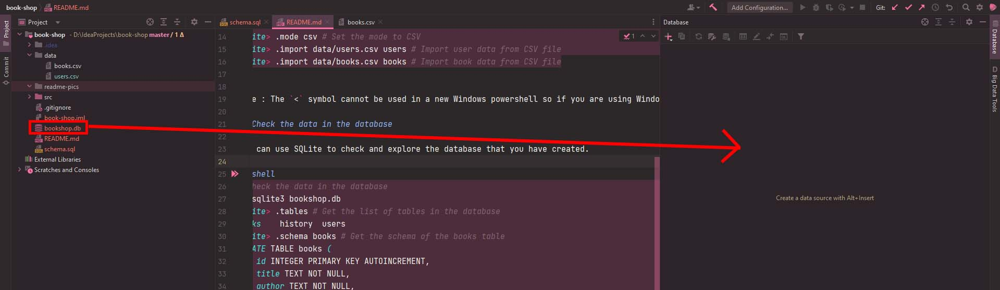
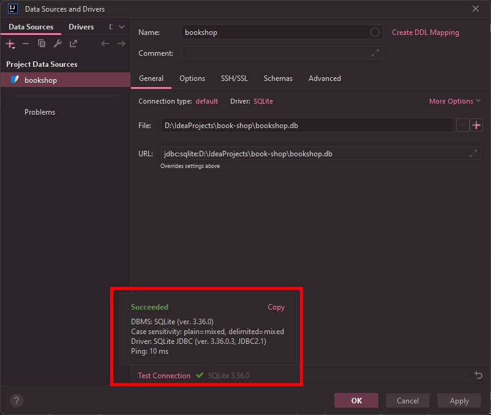
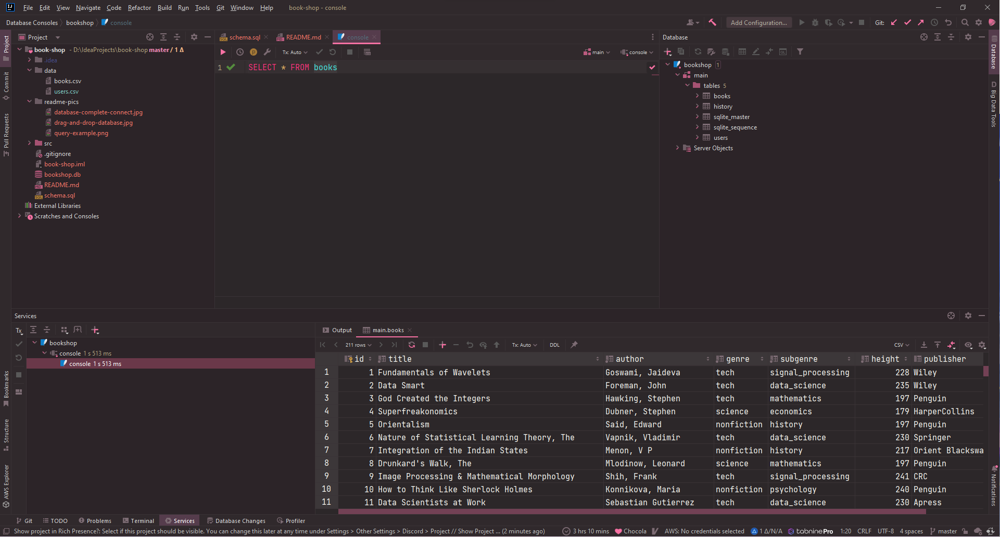

# Book shop

Simple database backed app mocking a book shop.

## Create database schema and import data from CSV files

Use SQLite and `sqlite3` to create a database schema using command line and given SQL schema file.

```shell
# Create a new SQLite database file and execute the SQL schema file
~$ sqlite3 bookshop.db < schema.sql

# Import the data from CSV files into the database
# First, get inside the database using sqlite3 command line
~$ sqlite3 bookshop.db
sqlite> .mode csv # Set the mode to CSV
sqlite> .import data/users.csv users # Import user data from CSV file
sqlite> .import data/books.csv books # Import book data from CSV file
```

Note : The `<` symbol cannot be used in a new Windows powershell so if you are using Windows powershell, please run this command in a normal command prompt instead.

## Check and explore the database

You can use SQLite command tool to check and explore the database that you have created.

```shell
# Check the data in the database
~$ sqlite3 bookshop.db
sqlite> .tables # Get the list of tables in the database
books    history  users
sqlite> .schema books # Get the schema of the books table
CREATE TABLE books (
    id INTEGER PRIMARY KEY AUTOINCREMENT,
    title TEXT NOT NULL,
    author TEXT NOT NULL,
    genre TEXT NOT NULL,
    subgenre TEXT NOT NULL,
    height INTEGER NOT NULL,
    publisher TEXT,
    price REAL NOT NULL
);
sqlite> SELECT * FROM books; # Show all the books
```

For IntelliJ IDEA Ultimate Edition, you can use the database functions that's available inside the IDE to explore the database too
by clicking on the `Database` tab in the left panel, then drag and drop the `bookshop.db` file into the `Database` panel.
If you can't drag and drop, just click the plus sign at left-top corner of the `Database` panel then `Data Source > SQLite` and select the `bookshop.db` file.



Then IntelliJ will require you to download some IntelliJ driver file for SQLite and it will complete fill the JDBC connection URL.
You can check the connection by click `Test Connection` button.



Then click `OK` to exit setup dialog. After that IntelliJ will open the database console. You can query some SQL commands there.
To check the data in the database without using the database console, you can double click on the table name (normally the table list is inside `bookshop > main > tables`)
to open the table inside IntelliJ. To reload the page click `Reload page` button or use `Ctrl + F5` to reload the query result.

